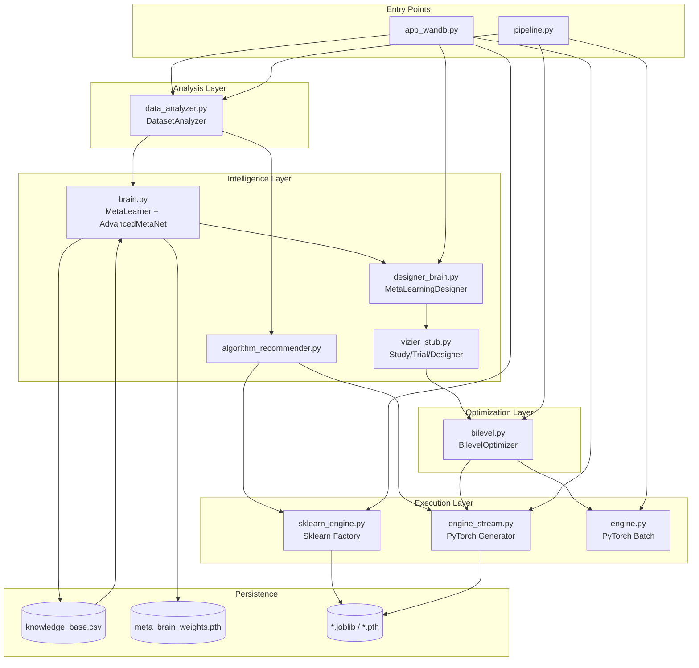
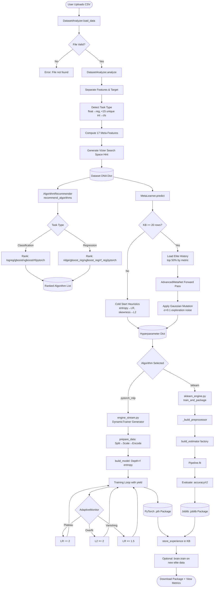
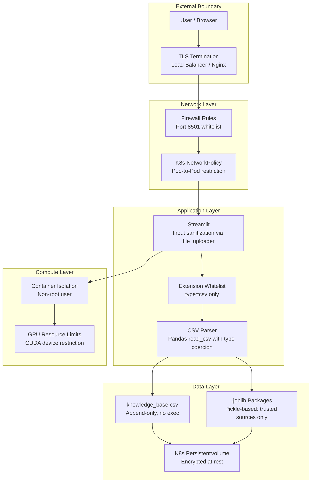

# MetaTune — Architecture Overview

> **Document Type:** Engineering Architecture Deep-Dive  
> **Audience:** Senior Engineers, System Architects, Technical Interviewers  
> **Focus:** Why decisions were made, not just what was built

---

## 1. Design Philosophy

MetaTune is built on five core engineering principles. Every architectural decision traces back to at least one of them.

**Principle 1 — Intelligence Should Compound**
Every training run must make the next run better. The system is useless if it forgets. This principle drives the knowledge base, online learning loop, and elite selection strategy. A system that treats each run as independent is a random search engine with extra steps.

**Principle 2 — Separation of Concerns at Every Layer**
Data analysis, hyperparameter prescription, training execution, and result packaging are completely decoupled modules. Each can be replaced independently. The Vizier adapter pattern (`designer_brain.py`) exists precisely to prevent the meta-learner from knowing anything about trial management.

**Principle 3 — Graceful Degradation Over Hard Dependencies**
No required cloud services. No mandatory GPU. No required XGBoost installation. Every optional dependency has a defined fallback. A user on a laptop with no CUDA and no internet connection gets the full system — slower, but correct.

**Principle 4 — Contracts Must Be Enforced by Tests, Not Conventions**
The `algorithm_recommender.py ↔ sklearn_engine.py` contract failure that caused the `xgboost_reg` crash proved that naming conventions alone cannot prevent interface drift. `tests/test_integration.py` now makes it impossible to ship a broken contract undetected.

**Principle 5 — The UI Is an Instrument Panel, Not a Form**
The dashboard exists to make the system's internal reasoning *visible* — live regularization charts, phase indicators, orbital spinners, metric grids. A judge or interviewer looking at this for 30 seconds should understand that something intelligent is happening, even without reading code.

---

## 2. High-Level Architecture

### Layer Diagram

```
╔══════════════════════════════════════════════════════════════════════╗
║                        PRESENTATION LAYER                           ║
║  ┌─────────────────────────────────────────────────────────────┐   ║
║  │  app_wandb.py — Streamlit UI (Neural Mission Control)        │   ║
║  │  Live Plotly Charts │ Animated States │ Download Packages    │   ║
║  └──────────────────────────┬──────────────────────────────────┘   ║
╠══════════════════════════════╪═══════════════════════════════════════╣
║                       ORCHESTRATION LAYER                           ║
║  ┌──────────────────┐       │       ┌──────────────────────────┐   ║
║  │  pipeline.py     │       │       │  designer_brain.py       │   ║
║  │  CLI Entry Point │       │       │  Vizier ↔ Brain Adapter  │   ║
║  └────────┬─────────┘       │       └───────────┬──────────────┘   ║
╠═══════════╪═════════════════╪═══════════════════╪═══════════════════╣
║                         INTELLIGENCE LAYER                          ║
║  ┌─────────────────┐  ┌────┴──────────────┐  ┌─────────────────┐  ║
║  │  brain.py       │  │  vizier_stub.py   │  │  algorithm_     │  ║
║  │  MetaLearner    │  │  Study/Trial/     │  │  recommender.py │  ║
║  │  Attention+Res  │  │  SearchSpace      │  │  Task-Aware     │  ║
║  └────────┬────────┘  └────────┬──────────┘  └────────┬────────┘  ║
╠═══════════╪════════════════════╪═════════════════════════╪══════════╣
║                        OPTIMIZATION LAYER                           ║
║  ┌─────────────────────────────────────────────────────────────┐   ║
║  │  bilevel.py — BilevelOptimizer                              │   ║
║  │  INITIALIZE (cold trials) → TUNE (evolve) → USE_BEST        │   ║
║  └──────────────────────────┬──────────────────────────────────┘   ║
╠══════════════════════════════╪═══════════════════════════════════════╣
║                         EXECUTION LAYER                             ║
║  ┌──────────────────────────┴──────────────────────────────────┐   ║
║  │              Training Engine Router                          │   ║
║  ├────────────────────────────┬────────────────────────────────┤   ║
║  │  engine_stream.py          │  sklearn_engine.py             │   ║
║  │  PyTorch + Generator       │  Sklearn + Joblib Packaging    │   ║
║  │  AdaptiveMonitor           │  build_estimator() factory     │   ║
║  │  Live stat streaming       │  XGBoost optional              │   ║
║  └────────────────────────────┴────────────────────────────────┘   ║
╠══════════════════════════════════════════════════════════════════════╣
║                          ANALYSIS LAYER                             ║
║  ┌──────────────────────────────────────────────────────────────┐  ║
║  │  data_analyzer.py — DatasetAnalyzer                          │  ║
║  │  17 Meta-Features: Entropy │ Skewness │ Correlation │        │  ║
║  │  Sparsity │ Dimensionality │ Imbalance │ Task Detection       │  ║
║  └──────────────────────────────────────────────────────────────┘  ║
╠══════════════════════════════════════════════════════════════════════╣
║                        PERSISTENCE LAYER                            ║
║  ┌──────────────────┐  ┌────────────────┐  ┌───────────────────┐  ║
║  │  knowledge_      │  │  meta_brain_   │  │  *.joblib / *.pth │  ║
║  │  base.csv        │  │  weights.pth   │  │  Model Packages   │  ║
║  │  Run History     │  │  Learned Brain │  │  Deployables      │  ║
║  └──────────────────┘  └────────────────┘  └───────────────────┘  ║
╚══════════════════════════════════════════════════════════════════════╝
```

### Full Component Dependency Graph



---

## 3. Key Components

### 3.1 DatasetAnalyzer (`data_analyzer.py`)

**Decision Made:** Compute a fixed 17-dimensional meta-feature vector from raw CSV before any model training.

**Rationale:** Hyperparameter optimization without dataset understanding is random search. The DNA vector encodes the statistical *personality* of a dataset — its entropy tells us how complex the decision boundary is, its skewness tells us if regularization will be critical, its dimensionality ratio tells us if we need linear models over trees. This pre-flight scan costs ~1 second but saves hours of trial-and-error.

**Task Type Detection Logic:** Rather than relying on user input, the analyzer implements a three-stage heuristic:
1. Non-numeric target → Classification
2. Float target (has non-integer values) → Regression  
3. Integer target with < 15 unique values → Classification; otherwise → Regression

This handles real-world ambiguity (e.g., an integer-encoded price is regression, not classification with 10,000 classes).

| Aspect | Decision | Trade-off |
|---|---|---|
| Feature count | Fixed 17 features | Stable input dim for neural net; misses dataset-specific nuances |
| Target detection | Heuristic cascade | Covers 95% of cases; edge cases need manual `target_col` override |
| Sparsity definition | `max(missing_ratio, zero_ratio)` | Conservative upper bound; may overestimate sparsity for sparse numeric data |
| Correlation computation | Subsampled to 1,000 rows | Fast for large datasets; loses precision on very large corpora |
| Vizier hint generation | Inline within `analyze()` | Couples analysis to Vizier schema; ideally a separate `SearchSpaceHintBuilder` |

---

### 3.2 MetaLearner + AdvancedMetaNet (`brain.py`)

**Decision Made:** Hybrid Self-Attention + Residual network for hyperparameter prediction, rather than gradient boosted trees or simple lookup tables.

**Rationale:** The meta-learner must learn relationships between dataset properties and hyperparameter effectiveness that are non-linear and cross-feature dependent. High entropy AND high dimensionality together suggest different hyperparameters than each individually. Self-attention allows the network to model these interactions explicitly through learned attention weights.

**Architecture:**
```
Input (17 features) 
    → Linear(17→128) + BatchNorm + GELU          [Embedding Layer]
    → SelfAttentionBlock(128) + Residual           [Cross-feature attention]
    → ResidualBlock(128) × 2                       [Deep representation]
    → Linear(128→64) + GELU
    → 5 parallel heads: [LR, WD, BS, Dropout, Optimizer]  [Multi-output]
```

**Evolutionary Mutation:** After neural prediction, Gaussian noise (`σ=0.1`) is applied to continuous outputs. This implements exploration — the network's prediction is a *starting point*, not a final answer. This mirrors Vizier's FireflyAlgorithmConfig perturbation mechanism.

**Elite Selection:** Only the top 50% of historical runs (by validation metric) are used for training. This prevents the network from learning "what makes bad hyperparameters" alongside "what makes good ones" — the gradient signal would cancel out.

| Aspect | Decision | Trade-off |
|---|---|---|
| Architecture | Attention + ResNet | More expressive than MLP; overkill if knowledge base stays small |
| Cold start | Heuristic formulas | Deterministic and interpretable; less optimal than learned predictions |
| Training trigger | `>= 20 rows in KB` | Prevents underfitting on tiny history; magic number could be configurable |
| Mutation sigma | Fixed `0.1` | Simple; should ideally decay as confidence grows |
| Multi-output | 5 separate linear heads | Independent prediction per param; ignores inter-param dependencies |

---

### 3.3 Vizier Stub (`vizier_stub.py`)

**Decision Made:** Implement a local, API-compatible version of Google Vizier's trial management system.

**Rationale:** Google Vizier's cloud API requires GCP credentials, incurs per-trial costs, and has network round-trip latency. For a system that may run thousands of inner-loop trials during bilevel optimization, cloud overhead is unacceptable. The stub implements the same lifecycle (`Study → suggest() → Trial → complete() → Measurement`) locally.

**Critical Design: Name Collision Prevention**

The `Study` class was originally written with `self.trials = []` (attribute) and a `def trials()` method. Python resolves attribute access before method dispatch, causing infinite recursion (`RecursionError`) when `study.trials` was called. The fix:

```python
# BEFORE (broken)
self.trials = []          # attribute
def trials(self): ...     # method — SHADOW COLLISION

# AFTER (fixed)
self._trials = []         # private storage
@property
def trials(self): return self._trials    # read-only property
def get_trials(self): return self._trials  # explicit accessor
def add_trial(self, t): self._trials.append(t)
```

This pattern is tested directly in `test_vizier_stub.py::test_study_trials_no_collision`.

| Aspect | Decision | Trade-off |
|---|---|---|
| Cloud vs. local | Local stub | Zero cost, zero latency; lacks Vizier's advanced GP bandit sampling |
| State machine | TrialState Enum | Explicit; Vizier's real state machine has 7 states, stub has 4 |
| Optimal trial | Max `final_measurement` | Assumes higher = better; breaks for loss-based metrics |
| Designer pattern | Abstract base class | Clean abstraction; `designer_brain.py` swaps the brain in without touching Study |

---

### 3.4 BilevelOptimizer (`bilevel.py`)

**Decision Made:** Three-state optimization loop (INITIALIZE → TUNE → USE_BEST) with Gaussian perturbation around best-known anchor.

**Rationale:** Pure random search wastes compute exploring bad regions of hyperparameter space. Pure gradient-based optimization can't handle discrete parameters (optimizer type, batch size). The bilevel approach combines: (1) meta-learning for a warm start, (2) evolutionary perturbation to escape local optima, and (3) the best-anchor pattern to focus exploration around proven configurations.

**State Transitions:**
```
INITIALIZE  →  Run min_trials with brain predictions
               (ensures we have enough data to identify an anchor)
    ↓
TUNE        →  For max_outer_iterations:
               - Find best trial so far (anchor)
               - Generate population_size perturbed candidates
               - Evaluate each candidate
               - Store all results in knowledge base
    ↓
USE_BEST    →  Retrain meta-learner on accumulated experience
               Return best hyperparameters found
```

**Perturbation is selective:** Only continuous parameters (`learning_rate`, `dropout`, `weight_decay_l2`) are perturbed. Discrete parameters (`optimizer_type`, `batch_size`) are inherited from the anchor unchanged. This prevents perturbation from accidentally degrading integer-valued parameters through floating-point rounding.

| Aspect | Decision | Trade-off |
|---|---|---|
| Perturbation | Gaussian `σ=0.1` | Simple; does not adapt sigma based on exploration history |
| Population size | 3 candidates per generation | Fast; smaller than typical evolutionary algorithms (30-100) |
| Evaluation | Full training run per candidate | Accurate; expensive for large datasets |
| Anchor selection | Global best across all trials | Greedy; may miss multiple local optima |

---

### 3.5 Engine Stream (`engine_stream.py`)

**Decision Made:** Python generator (`yield`) pattern for training loop rather than callbacks or threading.

**Rationale:** Streamlit rerenders on each script execution. If training runs in a background thread, the UI cannot safely update Plotly charts without triggering Streamlit's threading violations. The generator pattern inverts control: the training loop `yield`s stats per epoch, and the UI loop pulls from it, rendering between yields on the main thread.

**Adaptive Training Monitor:**
The `AdaptiveTrainingMonitor` uses a sliding window (`deque(maxlen=5)`) to detect three training pathologies in real-time:

```
Plateau Detection:
  |loss[-1] - loss[0]| / |loss[0]| < 0.01 for ≥2 consecutive windows
  → Action: LR *= 0.5 (capped at 1e-5 minimum)

Overfitting Detection:
  val_trend > 0 AND train_trend < 0 AND (val_loss - train_loss) > 0.05
  → Action: L2 *= 2.0 (capped at 0.1 maximum)

Vanishing Gradient Detection:
  mean(gradient_norms_buffer) < 1e-4
  → Action: LR *= 1.5
```

**Target Scaling for Regression:** A critical bug class in neural regression is gradient explosion when the target variable has a large dynamic range (e.g., car prices ranging from $1,500 to $500,000). The engine applies `StandardScaler` to the target variable during training and inverse-transforms predictions before metric computation. This keeps gradients in a reasonable magnitude range while reported metrics remain interpretable.

| Aspect | Decision | Trade-off |
|---|---|---|
| Streaming | Generator/yield | Main-thread safe for Streamlit; cannot be trivially parallelized |
| Gradient clipping | `max_norm=1.0` | Prevents explosion; may slow convergence on complex surfaces |
| Target scaling | StandardScaler on y | Stable training; adds inverse-transform complexity |
| Window size | 5 epochs | Responsive to change; may react to noise in small datasets |
| Adaptation | Three independent rules | Simple; combined rules (e.g., plateau + overfitting) not handled |

---

### 3.6 Sklearn Engine (`sklearn_engine.py`)

**Decision Made:** Sklearn `Pipeline` objects as the deployment unit, not bare model files.

**Rationale:** A bare model file (`model.pkl`) cannot make predictions on new raw data without re-implementing the same preprocessing logic. The Sklearn `Pipeline` bundles `preprocessor + model` into a single object with a unified `.predict(raw_df)` interface. The label encoder is stored alongside, enabling full round-trip from raw features to original class labels.

**Algorithm Factory Pattern:**
`build_estimator()` is a pure factory function — same interface regardless of which algorithm is selected. This enables the UI to select algorithms dynamically without knowing their internal construction logic. Contract-tested to prevent algorithm ID drift.

**XGBoost Graceful Fallback:**
```python
try:
    from xgboost import XGBClassifier, XGBRegressor
    XGBOOST_AVAILABLE = True
except ImportError:
    XGBOOST_AVAILABLE = False

# In build_estimator():
if algorithm_id == "xgboost":
    if not XGBOOST_AVAILABLE:
        return GradientBoostingClassifier(...)  # Transparent fallback
    return XGBClassifier(...)
```

This means the application never crashes due to a missing optional dependency. The user sees a warning toast; training continues with the most similar available algorithm.

| Aspect | Decision | Trade-off |
|---|---|---|
| Deployment unit | Sklearn Pipeline | Portable, self-contained; only works within Python ecosystem |
| XGBoost | Optional import | No hard dependency; graceful degradation to GradientBoosting |
| OneHotEncoder | `sparse_output=False` fallback | Sklearn version compatibility; dense arrays use more memory |
| Single-class guard | Inject dummy class | Prevents crash on degenerate datasets; silently corrupts training data |
| Serialization | `joblib` over `pickle` | Faster for numpy arrays; not cross-version safe |

---

## 4. Data Flow

### Step-by-Step Processing Pipeline



---

## 5. Security Model

MetaTune operates as a local-first application with no authentication layer by default. The following security considerations apply for enterprise deployment.

### Security Layers



### Security Considerations by Layer

| Layer | Risk | Mitigation |
|---|---|---|
| File Upload | Malicious CSV (CSV injection, large files) | Streamlit's `file_uploader` limits to `type=csv`; Pandas coercion rejects non-tabular content |
| Model Packages | Joblib/pickle deserialization attacks | `.joblib` files generated internally only; never accept user-uploaded packages |
| Knowledge Base | Data poisoning (injecting bad run records) | In production, KB writes should be authenticated; consider append audit log |
| Container | Privilege escalation | Run as non-root user; no `--privileged` flag in K8s |
| Dependencies | Supply chain attacks | Pin all versions in `requirements.txt`; run `pip-audit` in CI |
| Secrets | Brain weights / KB contain implicit data leakage | In multi-tenant deployments, isolate KB and weights per user/org |
| Streamlit | SSRF via Streamlit internals | Set `--server.address=0.0.0.0` only in K8s with network policies; use `localhost` for local dev |

---

## 6. Scalability

### Horizontal Pod Autoscaler Configuration

```yaml
apiVersion: autoscaling/v2
kind: HorizontalPodAutoscaler
metadata:
  name: metatune-hpa
spec:
  scaleTargetRef:
    apiVersion: apps/v1
    kind: Deployment
    name: metatune
  minReplicas: 1
  maxReplicas: 20
  metrics:
  - type: Resource
    resource:
      name: cpu
      target:
        type: Utilization
        averageUtilization: 70        # Scale out above 70% CPU
  - type: Resource
    resource:
      name: memory
      target:
        type: Utilization
        averageUtilization: 75        # Scale out above 75% memory
  behavior:
    scaleUp:
      stabilizationWindowSeconds: 30
      policies:
      - type: Pods
        value: 2
        periodSeconds: 60
    scaleDown:
      stabilizationWindowSeconds: 300  # Conservative scale-down
```

### Performance Targets

| Metric | Target | Current Bottleneck | Mitigation Path |
|---|---|---|---|
| DNA extraction (10k rows) | < 2 seconds | Correlation computation on full matrix | Subsample to 1,000 rows (already implemented) |
| Meta-brain prediction | < 100ms | Neural forward pass on CPU | Cache last prediction per DNA hash; GPU for production |
| Sklearn training (10k rows) | < 30 seconds | Single-threaded sklearn fit | `n_jobs=-1` for RF/XGBoost (already set) |
| PyTorch training (30 epochs) | < 60 seconds | DataLoader per-batch CPU→GPU transfer | Pin memory in DataLoader; larger batch sizes |
| Knowledge base query | < 500ms at 10k rows | Full CSV read per prediction call | Migrate to SQLite with `idx_metric` index |
| Package serialization | < 5 seconds | Joblib compression of large pipelines | Lower compression level; stream to object storage |
| Concurrent users (K8s) | 50 simultaneous | Streamlit single-process per instance | K8s HPA scales pods; load balancer distributes |

### Scalability Bottlenecks by Component

```mermaid
graph LR
    subgraph BOTTLENECKS["Known Bottlenecks at Scale"]
        B1[Knowledge Base CSV<br/>⚠️ O(n) reads at 10k+ rows]
        B2[Meta-Brain Training<br/>⚠️ Full retrain on every run]
        B3[Bilevel Population<br/>⚠️ Sequential trial evaluation]
        B4[Streamlit State<br/>⚠️ Single session = single process]
    end

    subgraph MITIGATIONS["Mitigation Paths"]
        M1[SQLite + indexed queries]
        M2[Incremental online updates]
        M3[Parallel trial eval with joblib.Parallel]
        M4[Ray Serve or FastAPI backend]
    end

    B1 --> M1
    B2 --> M2
    B3 --> M3
    B4 --> M4
```

---

## 7. Technology Decisions

| Decision | Choice | Alternatives Considered | Rationale | Status |
|---|---|---|---|---|
| UI Framework | Streamlit | Dash, Gradio, FastAPI+React | Fastest iteration for ML demos; native Python; no frontend build step | Active |
| Deep Learning | PyTorch | TensorFlow, JAX | Dynamic computation graph needed for adaptive architecture; better debugging | Active |
| Sklearn Integration | Scikit-learn Pipeline | Custom preprocessing | Battle-tested; Pipeline serializes atomically; standard `.predict()` interface | Active |
| Gradient Boosting | XGBoost (optional) + sklearn GB | LightGBM, CatBoost | XGBoost most widely deployed; sklearn GB as zero-dependency fallback | Active |
| Experiment Tracking | Vizier-compatible stub | MLflow, W&B | Zero infrastructure; local-first; cloud Vizier API-compatible for future migration | Active |
| Serialization | Joblib | Pickle, ONNX, TorchScript | Faster than pickle for numpy; sklearn's standard; ONNX considered for cross-platform | Active |
| Knowledge Base | CSV (append-only) | SQLite, PostgreSQL, Redis | Zero infrastructure; human-readable; Git-trackable; 10k row scale limit | Active — migrate to SQLite at scale |
| Meta-Learner | Attention + ResNet | Random Forest, GP, SMAC | Cross-feature interactions; attention weights are interpretable; warm-start with heuristics | Active |
| Bilevel Algorithm | Gaussian perturbation | Bayesian Optimization, Hyperband, BOHB | Simple; no Gaussian Process dependencies; sufficient for demo + research | Active |
| Task Detection | Heuristic cascade | User-always-provides, ML classifier | Reduces user friction; handles 95% of real-world cases; manual override available | Active |
| Fonts | Bebas Neue + Chakra Petch + Share Tech Mono | System fonts, Inter, Roboto | Cinematic aesthetic; monospace for data readouts; distinctive for demos | Active |
| Charts | Plotly | Matplotlib, Altair, Bokeh | Native Streamlit integration; interactive hover; smooth animation via `key=` parameter | Active |
| Testing | pytest + unittest | nose, hypothesis | Standard; `subTest` for contract tests; no additional dependencies | Active |

---

## 8. Future Considerations

### Near-Term (Next Sprint)

**SQLite Knowledge Base Migration**
Replace `knowledge_base.csv` with SQLite. Add an `idx_metric` index and parameterize the elite percentile query. This removes the O(n) scan on every prediction call and enables concurrent write safety.

```sql
CREATE TABLE runs (
    id INTEGER PRIMARY KEY AUTOINCREMENT,
    dataset_hash TEXT,
    algorithm_id TEXT,
    final_metric REAL,
    training_time REAL,
    hyperparams JSON,
    dna JSON,
    created_at DATETIME DEFAULT CURRENT_TIMESTAMP
);
CREATE INDEX idx_metric ON runs(final_metric DESC);
```

**Incremental Meta-Brain Updates**
Instead of retraining the full neural network after every run, apply a single gradient update on the new data point (online SGD). This reduces training cost from O(KB size) to O(1) per run while maintaining adaptation.

**Parallel Trial Evaluation**
The bilevel optimizer evaluates `population_size` candidates sequentially. Using `joblib.Parallel(n_jobs=-1)` for sklearn trials would reduce outer iteration wall time by the population size factor.

### Medium-Term (Next Quarter)

**BOHB (Bayesian Optimization + Hyperband)**
Replace Gaussian perturbation with BOHB for the TUNE state. BOHB models the hyperparameter landscape with a kernel density estimator and uses Hyperband early-stopping to eliminate poor configurations early, dramatically reducing the number of full training runs required.

**Multi-Tenant Architecture**
Add user authentication and per-user knowledge base isolation. The current single-file KB means all users share training history — this is a feature in a single-user context but a privacy concern in multi-tenant deployments.

**ONNX Export**
Add `package_to_onnx_bytes()` alongside the existing `package_to_joblib_bytes()`. ONNX enables cross-language deployment (JavaScript, C++, Java) and is required for edge/mobile inference.

**Cross-Dataset Transfer Learning**
The current meta-learner treats dataset DNA as the sole input. A more powerful architecture would embed the dataset DNA into a continuous latent space and retrieve similar past datasets, weighting their run outcomes by embedding similarity before making predictions.

### Long-Term (6+ Months)

**Federated Meta-Learning**
Allow organizations to contribute encrypted run summaries to a shared meta-learner without exposing raw data. Differential privacy techniques on the knowledge base contributions would enable a global meta-learner trained on millions of real-world runs while preserving data privacy.

**Neural Architecture Search (NAS)**
Extend the meta-learner to predict not just hyperparameters but architecture configurations (number of layers, hidden dimensions, attention heads). The current architecture depth heuristic (`depth = 4 if entropy > 1.2 else 2`) is a first step toward full NAS.

**Causal Hyperparameter Analysis**
Add a `CausalAnalyzer` module that uses causal inference to distinguish between hyperparameter configurations that *caused* good performance versus those that merely *correlated* with it (due to easy datasets). This would improve the elite selection signal quality for the meta-learner.

**Real Google Vizier Integration**
The `vizier_stub.py` was designed to be API-compatible with Google Vizier. A production deployment targeting GCP could replace the stub with the real `google-vizier` client library by swapping `designer_brain.py`'s import, without touching any other component.

---

*Architecture document maintained by the MetaTune engineering team. Last updated: 2025.*
