# MetaTune — AI-Driven Hyperparameter Optimization


> **Every dataset has a DNA — MetaTune reads it, prescribes it, evolves it.**

MetaTune is an enterprise-grade, self-improving hyperparameter optimization platform that eliminates manual tuning through meta-learning, bilevel optimization, and real-time adaptive training. It ingests a raw CSV, extracts a statistical DNA fingerprint, prescribes optimal hyperparameters using a neural meta-learner, and delivers a production-ready deployable model package — all in a single workflow.

---

## Table of Contents

1. [Overview](#overview)
2. [Architecture](#architecture)
3. [Key Features](#key-features)
4. [Quick Start](#quick-start)
5. [API Reference](#api-reference)
6. [Deployment](#deployment)
7. [Configuration](#configuration)
8. [Testing](#testing)
9. [Project Structure](#project-structure)
10. [Engineering Trade-offs](#engineering-trade-offs)
11. [Contributing](#contributing)
12. [License](#license)

---

## Overview

### The Problem

Every ML practitioner faces the same bottleneck: hyperparameter tuning is expensive, time-consuming, and requires expert intuition. Grid search wastes compute. Random search is unguided. Even Bayesian optimization starts from scratch with every new dataset.

### The MetaTune Solution

MetaTune solves this with a **three-layer intelligence stack**:

1. **Dataset DNA Extraction** — The `DatasetAnalyzer` computes 17 meta-features (entropy, skewness, sparsity, dimensionality, class imbalance) to build a statistical fingerprint of any dataset.

2. **Neural Prescription** — A self-attention + residual network (`MetaLearner`) trained on historical run outcomes maps dataset DNA directly to optimal hyperparameters, bypassing trial-and-error entirely.

3. **Bilevel Evolutionary Optimization** — An outer evolutionary loop (`BilevelOptimizer`) continuously perturbs and evaluates candidate configurations, feeding results back into the meta-learner's knowledge base for online learning.

The result: a system that gets *smarter with every run* — across datasets, across sessions, across users.

---

## Architecture

### System Architecture

```mermaid
graph TB
    subgraph INPUT["📥 Data Ingestion Layer"]
        CSV[CSV Dataset Upload]
        TC[Target Column Detection]
    end

    subgraph PHASE1["🧬 Phase 1 — Forensic DNA Scan"]
        DA[DatasetAnalyzer<br/>data_analyzer.py]
        DNA[Dataset DNA<br/>17 Meta-Features]
        DA --> DNA
    end

    subgraph PHASE2["🧠 Phase 2 — Neural Prescription"]
        ML[MetaLearner Brain<br/>brain.py]
        VZ[Vizier Study<br/>vizier_stub.py]
        DB[MetaLearningDesigner<br/>designer_brain.py]
        AR[AlgorithmRecommender<br/>algorithm_recommender.py]
        ML --> VZ
        VZ --> DB
        DB --> AR
    end

    subgraph PHASE3["🚀 Phase 3 — Bilevel Evolution Engine"]
        BL[BilevelOptimizer<br/>bilevel.py]
        
        subgraph ENGINES["Training Engines"]
            PT[DynamicTrainer PyTorch<br/>engine_stream.py]
            SK[SklearnEngine<br/>sklearn_engine.py]
        end
        
        MON[AdaptiveTrainingMonitor<br/>Real-time Detection]
        BL --> PT
        BL --> SK
        PT --> MON
    end

    subgraph PHASE4["💾 Phase 4 — Feedback Loop"]
        KB[Knowledge Base<br/>knowledge_base.csv]
        PKG[Deployable Package<br/>.joblib / .pth]
    end

    subgraph UI["🖥️ UI Layer"]
        APP[app_wandb.py<br/>Streamlit Dashboard]
    end

    subgraph EXTERNAL["🔗 External Dependencies"]
        WB[Weights & Biases<br/>Experiment Tracking]
        XGB[XGBoost<br/>Optional]
    end

    CSV --> DA
    TC --> DA
    DNA --> ML
    DNA --> AR
    DB --> BL
    AR --> BL
    MON --> KB
    BL --> PKG
    KB --> ML
    APP --> PHASE1
    APP --> PHASE2
    APP --> PHASE3
    PT --> WB
```



### Data Flow


### Component Interaction Map


---

## Key Features

- **Automatic Dataset Intelligence** — 17-dimensional meta-feature extraction including entropy, skewness, sparsity, dimensionality ratio, and class imbalance analysis. No manual feature engineering required.

- **Neural Meta-Learning** — Self-attention + residual network architecture trained on historical run data. Cold-start heuristics when no history exists; transitions to learned predictions automatically.

- **Bilevel Evolutionary Optimization** — Three-state optimization (INITIALIZE → TUNE → USE_BEST) mirrors Google Vizier's MetaLearningDesigner. Outer loop perturbs best anchors; inner loop evaluates candidates.

- **Real-Time Adaptive Training** — `AdaptiveTrainingMonitor` detects plateau (halves LR), overfitting (doubles L2), and vanishing gradients (boosts LR) mid-training without user intervention.

- **Multi-Algorithm Support** — Intelligent routing between PyTorch MLP, XGBoost, Gradient Boosting, Random Forest, Logistic/Ridge Regression based on dataset characteristics. Contract-tested to prevent algorithm ID mismatches.

- **Production-Ready Deployment Packages** — Sklearn models exported as `.joblib` bundles (preprocessor + model + label encoder). PyTorch models exported as `.pth` state dicts.

- **Online Learning Loop** — Every training run's result feeds back into the knowledge base. The meta-learner retrains on elite runs (top 50% by performance), progressively improving future prescriptions.

- **Enterprise UI** — Neural Mission Control aesthetic with live Plotly charts for loss convergence and adaptive regularization tracking. Cinematic animations for training state transitions.

- **Contract-Tested Integration** — `tests/test_integration.py` enforces that every algorithm ID the recommender can output is handled by the engine. Regression tests named after specific bugs prevent silent breakage.

---

## Quick Start

### Prerequisites

```bash
python --version  # 3.9 or higher required
```

### Installation

```bash
# 1. Clone the repository
git clone https://github.com/your-org/metatune.git
cd metatune

# 2. Create and activate virtual environment
python -m venv .venv
source .venv/bin/activate       # Linux/macOS
.venv\Scripts\activate          # Windows PowerShell

# 3. Install dependencies
pip install -r requirements.txt

# 4. Optional: Install XGBoost for extended algorithm support
pip install xgboost
```

### Run the Interactive Dashboard

```bash
streamlit run app_wandb.py
```

Navigate to `http://localhost:8501`, upload any CSV file, and click **IGNITE ENGINE**.

### Run the CLI Pipeline

```bash
# Classification dataset
python pipeline.py path/to/dataset.csv --target target_column --epochs 30

# Regression dataset (auto-detects if target is float)
python pipeline.py global_car_dataset.csv --target price_usd --epochs 20

# Generate the demo global car dataset (15,000 rows, 40+ brands)
python car.py
python pipeline.py global_car_dataset.csv --target price_usd
```

### Generate Test Data

```bash
# Generate audit stress-test dataset (nulls, outliers, imbalance, high cardinality)
python generate_audit_data.py

# Verify the full system end-to-end
python verify_metatune.py

# Verify evolutionary improvement over 15 generations
python verify_evolution.py
```

---

## API Reference

MetaTune exposes its core intelligence as importable Python modules.

### Core Module APIs

| Module | Function/Class | Signature | Returns |
|---|---|---|---|
| `data_analyzer` | `DatasetAnalyzer` | `__init__(file_path, target_col=None)` | Instance |
| `data_analyzer` | `.load_data()` | `→ bool` | Success flag |
| `data_analyzer` | `.analyze()` | `→ dict` | 17-feature DNA dict |
| `brain` | `MetaLearner` | `__init__()` | Instance |
| `brain` | `.predict(dna)` | `dict → dict` | Hyperparameter dict |
| `brain` | `.store_experience(dna, params, metric)` | `→ None` | Side-effect: appends to KB |
| `brain` | `.train(epochs=50)` | `→ None` | Trains on elite history |
| `algorithm_recommender` | `recommend_algorithms(dna, hyperparams)` | `dict → dict` | `{recommendations, n_trials_budget}` |
| `sklearn_engine` | `train_and_package(...)` | `→ Tuple[package, results]` | Model package + metrics |
| `sklearn_engine` | `package_to_joblib_bytes(package)` | `dict → bytes` | Serialized `.joblib` bytes |
| `sklearn_engine` | `build_estimator(algo_id, task_type, ...)` | `→ estimator` | Sklearn estimator |
| `sklearn_engine` | `predict_with_package(package, df)` | `→ array` | Predictions |
| `vizier_stub` | `Study` | `__init__(designer, study_id, name)` | Study instance |
| `vizier_stub` | `Study.suggest(count)` | `→ List[Trial]` | New trials |
| `vizier_stub` | `Study.optimal_trials()` | `→ List[Trial]` | Best trials sorted by metric |
| `bilevel` | `BilevelOptimizer` | `__init__(meta_learner, config)` | Optimizer instance |
| `bilevel` | `.optimize(dna, X_tr, y_tr, X_val, y_val, task)` | `→ dict` | Best hyperparameters |

### Dataset DNA Schema

| Field | Type | Description |
|---|---|---|
| `n_instances` | int | Number of rows |
| `n_features` | int | Number of feature columns |
| `n_numerical` | int | Count of numeric features |
| `n_categorical` | int | Count of categorical features |
| `dimensionality` | float | n_features / n_instances ratio |
| `missing_ratio` | float | Fraction of missing values |
| `sparsity` | float | max(missing_ratio, zero_ratio) |
| `mean_skewness` | float | Average skewness across numeric features |
| `max_skewness` | float | Maximum absolute skewness |
| `mean_kurtosis` | float | Average kurtosis |
| `avg_correlation` | float | Mean pairwise feature correlation |
| `max_correlation` | float | Maximum pairwise correlation |
| `coefficient_variation` | float | Normalized standard deviation |
| `avg_cardinality` | float | Mean unique values per categorical column |
| `class_imbalance_ratio` | float | majority_class / minority_class count |
| `target_entropy` | float | Shannon entropy of target distribution |
| `normalized_entropy` | float | target_entropy / log(n_classes) |
| `task_type` | str | `"classification"` or `"regression"` |
| `task_difficulty_score` | float | Composite complexity score [0, 3] |

### Hyperparameter Output Schema

| Field | Type | Range | Description |
|---|---|---|---|
| `learning_rate` | float | [1e-4, 1e-1] | Optimizer step size |
| `weight_decay_l2` | float | [1e-6, 0.1] | L2 regularization strength |
| `batch_size` | int | [16, 256] | Training batch size |
| `dropout` | float | [0.0, 0.5] | Dropout rate |
| `optimizer_type` | str | `"adam"` / `"sgd"` | Optimizer selection |

---

## Deployment

### Docker

```dockerfile
# Dockerfile
FROM python:3.11-slim

WORKDIR /app

COPY requirements.txt .
RUN pip install --no-cache-dir -r requirements.txt && \
    pip install xgboost

COPY . .

EXPOSE 8501

HEALTHCHECK --interval=30s --timeout=10s \
    CMD curl -f http://localhost:8501/_stcore/health || exit 1

CMD ["streamlit", "run", "app_wandb.py", \
     "--server.port=8501", \
     "--server.address=0.0.0.0", \
     "--server.headless=true"]
```

```bash
# Build and run
docker build -t metatune:latest .
docker run -p 8501:8501 -v $(pwd)/data:/app/data metatune:latest

# With persistent knowledge base
docker run -p 8501:8501 \
  -v $(pwd)/knowledge_base.csv:/app/knowledge_base.csv \
  -v $(pwd)/meta_brain_weights.pth:/app/meta_brain_weights.pth \
  metatune:latest
```

### Docker Compose

```yaml
# docker-compose.yml
version: '3.8'

services:
  metatune:
    build: .
    ports:
      - "8501:8501"
    volumes:
      - ./knowledge_base.csv:/app/knowledge_base.csv
      - ./meta_brain_weights.pth:/app/meta_brain_weights.pth
      - ./uploads:/app/uploads
    environment:
      - METATUNE_ENV=production
      - METATUNE_LOG_LEVEL=INFO
    restart: unless-stopped
    healthcheck:
      test: ["CMD", "curl", "-f", "http://localhost:8501/_stcore/health"]
      interval: 30s
      timeout: 10s
      retries: 3
```

### Kubernetes

```yaml
# k8s/deployment.yaml
apiVersion: apps/v1
kind: Deployment
metadata:
  name: metatune
  labels:
    app: metatune
    version: "1.0"
spec:
  replicas: 2
  selector:
    matchLabels:
      app: metatune
  template:
    metadata:
      labels:
        app: metatune
    spec:
      containers:
      - name: metatune
        image: your-registry/metatune:latest
        ports:
        - containerPort: 8501
        resources:
          requests:
            memory: "1Gi"
            cpu: "500m"
          limits:
            memory: "4Gi"
            cpu: "2000m"
        env:
        - name: METATUNE_ENV
          value: "production"
        livenessProbe:
          httpGet:
            path: /_stcore/health
            port: 8501
          initialDelaySeconds: 30
          periodSeconds: 10
        volumeMounts:
        - name: knowledge-base
          mountPath: /app/knowledge_base.csv
          subPath: knowledge_base.csv
      volumes:
      - name: knowledge-base
        persistentVolumeClaim:
          claimName: metatune-kb-pvc

---
apiVersion: v1
kind: Service
metadata:
  name: metatune-service
spec:
  selector:
    app: metatune
  ports:
  - port: 80
    targetPort: 8501
  type: LoadBalancer

---
# Horizontal Pod Autoscaler
apiVersion: autoscaling/v2
kind: HorizontalPodAutoscaler
metadata:
  name: metatune-hpa
spec:
  scaleTargetRef:
    apiVersion: apps/v1
    kind: Deployment
    name: metatune
  minReplicas: 1
  maxReplicas: 10
  metrics:
  - type: Resource
    resource:
      name: cpu
      target:
        type: Utilization
        averageUtilization: 70
  - type: Resource
    resource:
      name: memory
      target:
        type: Utilization
        averageUtilization: 80
```

### CLI-Only Deployment (Headless)

```bash
# Run as a pure pipeline without UI (e.g., in a CI/CD job)
python pipeline.py dataset.csv --target label --epochs 50

# Outputs:
# - metatune_report.json     (full run report)
# - metatune_graph.png       (loss curve visualization)
# - knowledge_base.csv       (updated with this run)
```

---

## Configuration

### Environment Variables

| Variable | Default | Description |
|---|---|---|
| `METATUNE_ENV` | `development` | Runtime environment (`development`, `production`) |
| `METATUNE_LOG_LEVEL` | `INFO` | Logging verbosity (`DEBUG`, `INFO`, `WARNING`, `ERROR`) |
| `METATUNE_KB_PATH` | `knowledge_base.csv` | Path to persistent knowledge base CSV |
| `METATUNE_BRAIN_PATH` | `meta_brain_weights.pth` | Path to saved meta-learner weights |
| `METATUNE_MAX_TRIALS` | `100` | Maximum trial budget per optimization run |
| `METATUNE_MIN_KB_ROWS` | `20` | Minimum knowledge base rows before neural training activates |
| `METATUNE_ELITE_PERCENTILE` | `50` | Percentile threshold for elite run selection |
| `METATUNE_PERTURBATION` | `0.1` | Bilevel evolutionary perturbation sigma |
| `METATUNE_PERTURBATION_LB` | `0.01` | Minimum perturbation lower bound |
| `CUDA_VISIBLE_DEVICES` | `` | GPU device selection (empty = CPU) |
| `STREAMLIT_SERVER_PORT` | `8501` | Streamlit server port |
| `STREAMLIT_SERVER_ADDRESS` | `localhost` | Streamlit bind address |

### BilevelConfig Parameters

```python
from bilevel import BilevelConfig

config = BilevelConfig(
    min_trials=5,                    # Initial cold-start trials before evolution
    max_outer_iterations=10,         # Number of evolutionary generations
    population_size=3,               # Candidates evaluated per generation
    perturbation=0.1,                # Gaussian noise sigma for continuous params
    perturbation_lower_bound=0.01    # Minimum perturbable value floor
)
```

---

## Testing

### Run All Tests

```bash
# Full test suite
python -m pytest tests/ -v

# With coverage report
python -m pytest tests/ -v --cov=. --cov-report=html

# Run specific test file
python -m pytest tests/test_integration.py -v

# Run specific test
python -m pytest tests/test_integration.py::TestAlgorithmEngineContract::test_xgboost_regression_specifically -v
```

### Test Files

| File | What It Tests | Priority |
|---|---|---|
| `tests/test_integration.py` | **Contract test**: every algo ID the recommender outputs must be handled by the engine. Named regression tests for XGBoost bugs. | Critical |
| `tests/test_vizier_stub.py` | Vizier Study/Trial lifecycle, name collision prevention, optimal trial selection, SearchSpace.validate() | High |
| `tests/test_brain.py` | MetaLearner cold-start prediction structure, output key validation | High |
| `tests/test_data_analyzer.py` | DNA extraction correctness, CLI simulation, auto-target-detection | Medium |
| `tests/test_pipeline.py` | End-to-end pipeline, visualization, CLI argument parsing | Medium |
| `tests/test_audit_generation.py` | Audit data generation (stress test dataset) | Low |
| `test_audit.py` | Full system rigor: stress data, pipeline robustness, fake brain detector | High |

### The Fake Brain Detector Test

`test_audit.py::test_03_fake_code_detector` is particularly important for demos and interviews. It:

1. Records the cold-start (heuristic) prediction
2. Injects 10 artificial "high learning rate = good result" records into the knowledge base
3. Retrains the meta-learner
4. Checks that the warm prediction shifted meaningfully toward the injected history
5. Fails with "FAKE BRAIN DETECTED" if predictions are identical — proving the learning loop actually works

```bash
python test_audit.py
```

### Contract Test (Most Critical)

```bash
python -m pytest tests/test_integration.py -v
```

This test guards the `algorithm_recommender.py ↔ sklearn_engine.py` interface. If someone adds a new algorithm to the recommender without updating the engine, this test fails with a precise diagnostic message showing which algorithm ID is missing and in which task type branch.

---

## Project Structure

```
metatune/
│
├── app_wandb.py            # 🖥️  PRIMARY UI — Streamlit dashboard with live training
│                           #     Neural Mission Control aesthetic, Plotly charts,
│                           #     animated training states, joblib download
│
├── app.py                  # ⚠️  LEGACY stub — non-functional placeholder, do not use
│
├── brain.py                # 🧠  Meta-Learner core
│                           #     AdvancedMetaNet: SelfAttention + ResidualBlocks
│                           #     Cold-start heuristics → neural prescription → mutation
│
├── data_analyzer.py        # 🧬  Dataset DNA extractor
│                           #     17 meta-features: entropy, skewness, correlation,
│                           #     sparsity, dimensionality, task-type detection
│
├── algorithm_recommender.py # 🎯  Task-aware algorithm selector
│                            #     DNA → ranked algorithm list + search space
│                            #     Supports: logreg, gboost, xgboost, rf, ridge,
│                            #     gboost_reg, xgboost_reg, rf_reg, pytorch_mlp
│
├── sklearn_engine.py       # ⚙️  Sklearn training + packaging engine
│                           #     build_estimator(): algorithm factory
│                           #     train_and_package(): full pipeline → .joblib
│                           #     XGBoost optional with graceful fallback
│
├── engine_stream.py        # 🌊  PyTorch streaming trainer (generator pattern)
│                           #     AdaptiveTrainingMonitor: plateau/overfit/vanish detection
│                           #     Yields per-epoch stats for real-time UI updates
│
├── engine.py               # 📦  PyTorch batch trainer (callback pattern)
│                           #     Used by pipeline.py and bilevel.py
│
├── bilevel.py              # 🔄  Bilevel optimization orchestrator
│                           #     States: INITIALIZE → TUNE → USE_BEST
│                           #     Vizier-inspired: suggest → evaluate → perturb → store
│
├── vizier_stub.py          # 🔬  Google Vizier API local implementation
│                           #     Study, Trial, Designer, SearchSpace, Measurement
│                           #     Collision-safe: _trials (storage) vs trials (property)
│
├── designer_brain.py       # 🔗  Vizier ↔ MetaLearner adapter
│                           #     Wraps brain.predict() as Designer.suggest()
│                           #     Closes feedback loop via brain.store_experience()
│
├── pipeline.py             # 🚀  CLI orchestration entry point
│                           #     4-phase: Diagnosis → Prescription → Execution → Feedback
│                           #     Generates metatune_report.json + metatune_graph.png
│
├── car.py                  # 🚗  Demo dataset generator
│                           #     15,000 cars, 50+ global brands, realistic specs
│
├── generate_audit_data.py  # 🔥  Stress test dataset generator
│                           #     Nulls, outliers, high cardinality, class imbalance
│
├── cleanup.py              # 🧹  Project reset utility
│                           #     Removes temp files, models, CSVs while preserving core
│
├── debug_csv.py            # 🐛  CSV diagnostic utility
├── verify_metatune.py      # ✅  Full system verification script
├── verify_evolution.py     # 📈  15-generation evolutionary improvement tracer
│
└── tests/
    ├── test_integration.py     # 🔒  CONTRACT TEST — recommender ↔ engine sync
    ├── test_vizier_stub.py     # 🔬  Vizier lifecycle + collision prevention
    ├── test_brain.py           # 🧠  Meta-learner prediction structure
    ├── test_data_analyzer.py   # 🧬  DNA extraction correctness
    ├── test_pipeline.py        # 🚀  End-to-end pipeline + CLI
    └── test_audit_generation.py # 📊  Stress data generation
```

---

## Engineering Trade-offs

### 1. Meta-Learning vs. Pure Bayesian Optimization

**Decision:** Meta-learning (learn from cross-dataset history) over pure Bayesian optimization (optimize per dataset).

**Rationale:** Bayesian optimization starts blind with every new dataset. MetaTune's neural meta-learner has prior knowledge from every previous run, making first-trial predictions significantly better than random.

**Trade-off:** Meta-learning requires a knowledge base to be useful. The cold-start heuristic mitigates this but the system improves non-linearly — the first 20 runs are heuristic-driven; runs 21+ benefit from learned patterns.

### 2. Generator Pattern for PyTorch Training (`yield`)

**Decision:** `engine_stream.py` uses Python generators (`yield`) instead of callbacks.

**Rationale:** The generator approach decouples training from UI completely. Streamlit's architecture requires the main thread to own rendering. Callbacks in the old `engine.py` caused threading issues in Streamlit. Generators allow the UI to pull data at its own render cadence.

**Trade-off:** The generator cannot be trivially parallelized. Multi-trial bilevel optimization must call the generator sequentially per trial.

### 3. Sklearn Pipeline for Deployment, PyTorch for Research

**Decision:** Two separate engine paths — sklearn for deployable packages, PyTorch for research/live visualization.

**Rationale:** Sklearn's `Pipeline` object bundles the preprocessor + model + label encoder into a single serializable artifact with a unified `predict()` interface. PyTorch models require separate handling of preprocessing, which complicates deployment.

**Trade-off:** Feature duplication between `engine.py` and `sklearn_engine.py`. Bugs fixed in one engine's preprocessing logic must be manually mirrored. The contract test (`test_integration.py`) mitigates algorithm-level drift but not preprocessing drift.

### 4. CSV as Knowledge Base vs. Database

**Decision:** Append-only CSV (`knowledge_base.csv`) over SQLite/Postgres for storing run history.

**Rationale:** Zero infrastructure dependency. The knowledge base must survive session restarts without requiring a database service. CSV also makes the stored experience directly human-inspectable and Git-trackable.

**Trade-off:** CSV reads scale linearly with history size. At ~10,000+ rows, `pd.read_csv()` on every prediction call becomes a bottleneck. A future migration to SQLite with an indexed `final_metric` column would solve this without adding infrastructure complexity.

### 5. Elite Selection (Top 50%) vs. Full History Training

**Decision:** Train the meta-learner only on the top 50% of runs by validation metric.

**Rationale:** Training on poor runs teaches the network what *not* to do, but gradient descent on mixed-quality data converges to mediocrity rather than excellence. Survival-of-the-fittest selection biases the learner toward configurations that actually worked.

**Trade-off:** Early in the project's lifecycle (few runs), the 50% filter may leave insufficient training data. The system falls back to heuristics if fewer than 20 elite records exist.

### 6. vizier_stub.py — Local Vizier Implementation

**Decision:** Implement a local Vizier-compatible API (`vizier_stub.py`) rather than using Google Vizier's cloud service.

**Rationale:** Cloud Vizier has API costs, requires GCP credentials, and introduces network latency into the training loop. The stub implements the same `Study → Trial → Measurement → Designer.update()` lifecycle locally with zero external dependencies.

**Trade-off:** The stub lacks Vizier's advanced sampling algorithms (Gaussian Process bandits, Hyperband). The evolutionary perturbation in `BilevelOptimizer` is a simpler but effective substitute.

---

## Contributing

Contributions are welcome. Please read the contributing guidelines before submitting a PR.

Key rules for contributors:

1. **Always update both files together** — Any new algorithm added to `algorithm_recommender.py` must have a corresponding case in `sklearn_engine.build_estimator()` in the same commit.

2. **Run the contract test before pushing** — `python -m pytest tests/test_integration.py -v` must pass green.

3. **Name regression tests after bugs** — If you fix a crash, add a test with a descriptive name that references the bug (e.g., `test_xgboost_regression_specifically`).

4. **Never touch `app.py`** — It is a legacy stub retained for compatibility. All new development goes into `app_wandb.py`.

[Open an Issue](https://github.com/your-org/metatune/issues) · [Submit a PR](https://github.com/your-org/metatune/pulls)

---

## License

This project is licensed under the MIT License.

```
MIT License

Copyright (c) 2025 MetaTune Contributors

Permission is hereby granted, free of charge, to any person obtaining a copy
of this software and associated documentation files (the "Software"), to deal
in the Software without restriction, including without limitation the rights
to use, copy, modify, merge, publish, distribute, sublicense, and/or sell
copies of the Software, and to permit persons to whom the Software is
furnished to do so, subject to the following conditions:

The above copyright notice and this permission notice shall be included in all
copies or substantial portions of the Software.

THE SOFTWARE IS PROVIDED "AS IS", WITHOUT WARRANTY OF ANY KIND, EXPRESS OR
IMPLIED, INCLUDING BUT NOT LIMITED TO THE WARRANTIES OF MERCHANTABILITY,
FITNESS FOR A PARTICULAR PURPOSE AND NONINFRINGEMENT.
```
